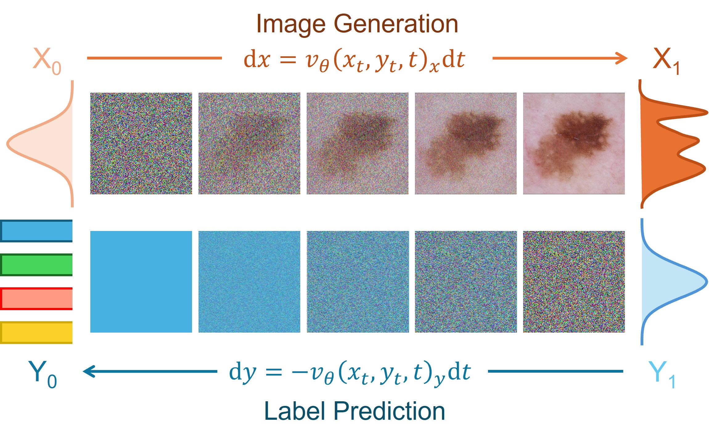

# MedSymmFlow

[](https://www.python.org/downloads/release/python-3918/)
[](https://mkdocstrings.github.io)
[](https://wandb.ai/site)

<p align="center">
  
</p>

**The official implementation of MedSymmFlow (DGM4MICCAI Workshop).**

## Prerequisites

You will need:

- `python` (see `pyproject.toml` for full version)
- `Git`
- `Make`
- a `.secrets` file with the required secrets and credentials
- load environment variables from `.env`
- `NVIDIA Drivers`(mandatory) and `CUDA >= 12.6` (mandatory if Docker/Apptainer is not used)
- `Weights & Biases` account

## Installation

Clone this repository (requires git ssh keys)

    git clone --recursive git@github.com:caetas/MedSymmFlow.git
    cd medsymmflow

### Using Docker or Apptainer

Create a `.secrets` file and add your Weights & Biases API Key:

    WANDB_API_KEY = <your-wandb-api-key>

#### Docker

Create the image using the provided [`Dockerfile`](Dockerfile)

    docker build --tag medsymmflow .

Or download it from the Hub:

    docker pull docker://ocaetas/medsymmflow

Then run the script [`job_docker.sh`](scripts/job_docker.sh) that will execute [`main.sh`](scripts/main.sh):

    cd scripts
    bash job_docker.sh

To access the shell, please run:

    docker run --rm -it --gpus all --ipc=host --env-file .env -v $(pwd)/:/app/ medsymmflow bash

#### Apptainer

Convert the Docker Image to a `.sif` file:

    apptainer pull medsymmflow.sif docker://ocaetas/medsymmflow

Then run the script [`job_apptainer.sh`](scripts/job_apptainer.sh) that will execute [`main.sh`](scripts/main.sh):
    
    cd scripts
    bash job_apptainer.sh

To access the shell, please run:

    apptainer shell --nv --env-file .env --bind $(pwd)/:/app/ medsymmflow.sif

**Add the flag `--nvccli` if you are using WSL.**

**Note: Edit the [`main.sh`](scripts/main.sh) script if you want to train a different model.**

### Normal Installation

Create the Conda Environment:

    conda env create -f environment.yml
    conda activate python3.11

#### On Linux

And then setup all virtualenv using make file recipe

    (python3.11) $ make setup-all

You might be required to run the following command once to setup the automatic activation of the conda environment and the virtualenv:

    direnv allow

Feel free to edit the [`.envrc`](.envrc) file if you prefer to activate the environments manually.

#### On Windows

You can setup the virtualenv by running the following commands:

    python -m venv .venv-dev
    .venv-dev/Scripts/Activate.ps1
    python -m pip install --upgrade pip setuptools
    python -m pip install -r requirements/requirements.txt


To run the code please remember to always activate both environments:

    conda activate python3.11
    .venv-dev/Scripts/Activate.ps1

## Training the Models

In addition to the instructions for using Docker or Apptainer, the documentation for training is available here: [`TRAINING.md`](docs/TRAINING.md).

## Download Pretrained Models

The folder containing the pretrained weights of the models used in the paper can be downloaded [`here`](https://zenodo.org/records/16086025).

## Running the Models

The instructions to run the models are available in [`INFERENCE.md`](docs/INFERENCE.md).

## License

This project is licensed under the terms of the `MIT` license.
See [LICENSE](LICENSE) for more details.

## Citation

If you publish work that uses MedSymmFlow, please cite MedSymmFlow as follows:

```bibtex
Will be added soon.
```
